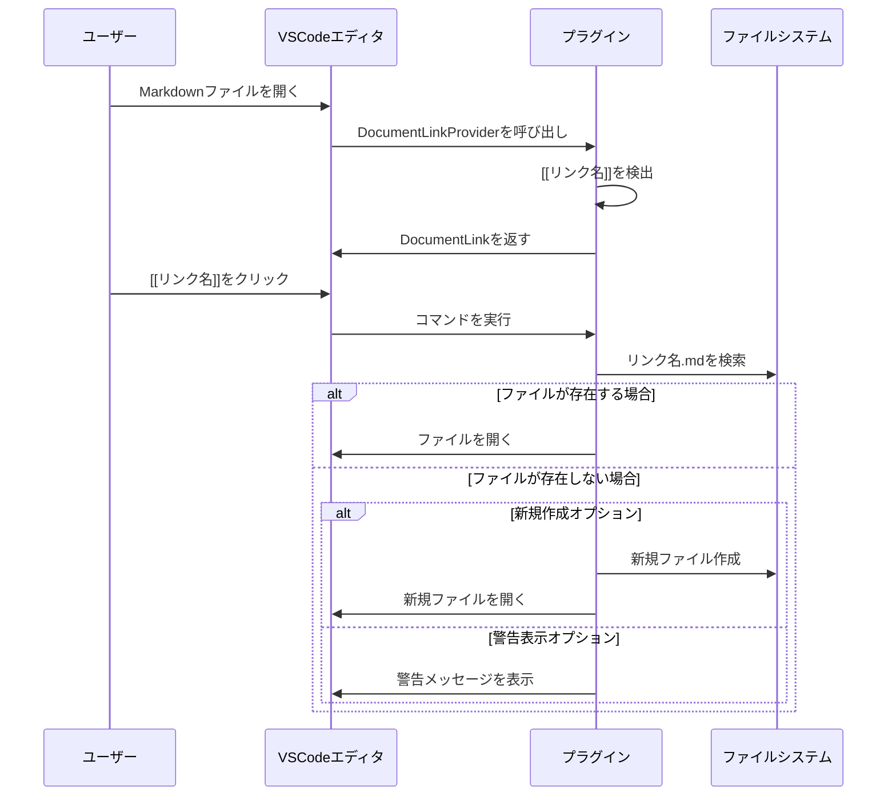

# 指示
- あなたはVSCodeのプラグイン開発者です。
- わたしはVSCodeでObisidianのプラグインを開発したいと考えています。
- 以下のような条件を満たすVSCodeのプラグインを開発してください

# 要件
- .mdファイル内の[[リンク名]]形式のテキストを検出する。
- そのテキストをクリック可能（ハイパーリンク風）にする。
- クリック時、同一リポジトリ内のリンク名.mdファイルを探し、存在すればそのファイルをVSCodeで開く。
- ファイルが存在しない場合は、オプションで新規作成するか、警告を表示する。

# シーケンスダイアグラム

# 作業プラン
1. プロジェクト初期化
[ ] VSCode拡張機能の雛形をyo codeで作成（TypeScript推奨）
[ ] Gitリポジトリ初期化、README作成
2. 基本機能の実装
2.1. DocumentLinkProviderの実装
[ ] extension.tsでvscode.languages.registerDocumentLinkProviderを登録
[ ] Markdownファイル内の[[リンク名]]を正規表現で検出
[ ] 検出範囲にDocumentLinkを付与
2.2. コマンドの実装
[ ] vscode.commands.registerCommandで「リンクを開く」コマンドを登録
[ ] DocumentLinkのtargetにコマンドURIを設定（command:xxx形式）
2.3. ファイル検索・オープン処理
[ ] コマンド実行時、vscode.workspace.findFilesでリンク名.mdを検索
[ ] ファイルが見つかればvscode.window.showTextDocumentで開く
3. 例外・オプション対応
3.1. ファイルが存在しない場合の処理
[ ] ファイルがなければ、設定に応じて
[ ] 新規作成（vscode.workspace.fs.writeFileで空ファイル作成→開く）
[ ] 警告表示（vscode.window.showWarningMessage）
3.2. 設定オプションの追加
[ ] package.jsonのcontributes.configurationでオプション追加
[ ] 「ファイルがなければ新規作成」or「警告のみ」切り替え
4. UI/UX向上
[ ] Hover時にリンク先ファイル名を表示（vscode.languages.registerHoverProviderの検討）
[ ] 複数ファイル候補がある場合の選択UI（showQuickPickの利用）
5. テスト・デバッグ
[ ] 複数パターンの[[リンク名]]で動作確認
[ ] サブディレクトリや日本語ファイル名での動作確認
[ ] Windows/Mac/Linuxでのパス処理確認
6. ドキュメント・公開準備
[ ] READMEに使い方・設定方法を記載
[ ] CHANGELOG.md作成
[ ] VSCode Marketplace用のパッケージング（vsceコマンド）